## 1. Brasil - atualizado em "24 August, 2020"


Tabela resumo de casos por Estado, acumulados e normalizados (x100.000 hab.)


```
## [1] 181
## attr(,"units")
## [1] "days"
```

```
## [1] 181
## attr(,"units")
## [1] "days"
```


Table: Resumo dos casos por Estado - normalizado por 100 mil habitantes

estado1                Total_casos   normalizado
--------------------  ------------  ------------
Roraima                      41730        6888.9
Distrito Federal            148998        4941.5
Amapá                        41120        4862.1
Sergipe                      70472        3065.7
Rondônia                     51421        2893.3
Amazonas                    115615        2789.5
Tocantins                    43596        2771.8
Acre                         23719        2689.4
Espírito Santo              105892        2635.0
Paraíba                     101132        2516.9
Mato Grosso                  81253        2331.9
Alagoas                      75857        2273.0
Ceará                       205441        2249.7
Pará                        189289        2200.3
Piauí                        71899        2196.6
Maranhão                    144400        2040.9
Santa Catarina              132492        1849.2
Rio Grande do Norte          59582        1699.0
Goiás                       116664        1662.3
São Paulo                   754129        1642.3
Bahia                       236050        1587.1
Mato Grosso do Sul           42498        1529.3
Pernambuco                  119140        1246.6
Rio de Janeiro              210948        1221.8
Paraná                      117959        1031.7
Rio Grande do Sul           109873         965.7
Minas Gerais                194614         919.3


## Casos reais vs casos simulados


Table: Casos novos reais e simulados

       dia  data           real   simulado
----  ----  -----------  ------  ---------
199    199  2020-08-14    50644      61860
200    200  2020-08-15    41576      62356
201    201  2020-08-16    23101      62847
202    202  2020-08-17    19373      63333
203    203  2020-08-18    47784      63812
204    204  2020-08-19    49298      64285
205    205  2020-08-20    45323      64753
206    206  2020-08-21    30355      65214
207    207  2020-08-22    50032      65669
208    208  2020-08-23    23421      66118


Table: Casos acumulados reais e simulados

       dia  data             real   simulado
----  ----  -----------  --------  ---------
199    199  2020-08-14    3275520    3438991
200    200  2020-08-15    3317096    3501038
201    201  2020-08-16    3340197    3563579
202    202  2020-08-17    3359570    3626608
203    203  2020-08-18    3407354    3690121
204    204  2020-08-19    3456652    3754111
205    205  2020-08-20    3501975    3818572
206    206  2020-08-21    3532330    3883498
207    207  2020-08-22    3582362    3948884
208    208  2020-08-23    3605783    4014722

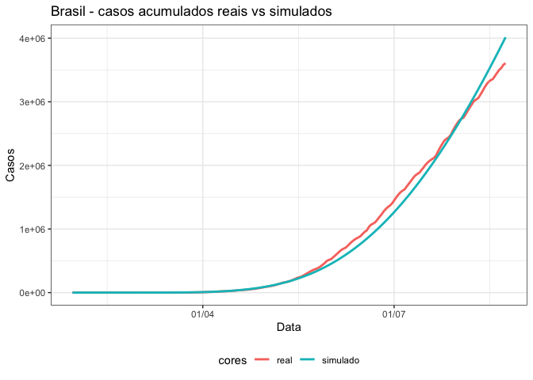<!-- -->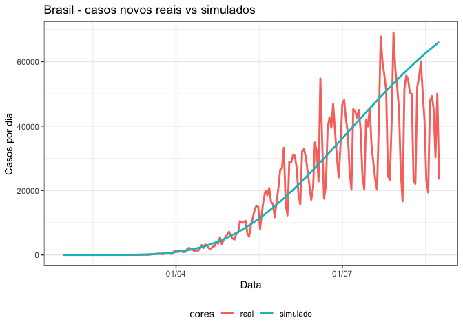<!-- -->

Com base nestes resultados, chegaremos aos 200.000 casos no dia:


 dia   BrAcum
----  -------
 107   197225

Ou seja, no dia:


|x          |
|:----------|
|2020-05-15 |

Similarmente, chegaremos aos 400.000 casos no dia:


 dia   BrAcum
----  -------
 122   399714


|x          |
|:----------|
|2020-05-29 |

Similarmente, chegaremos aos 800.000 casos no dia:


 dia   BrAcum
----  -------
 140   792842


|x          |
|:----------|
|2020-06-16 |

Chegaremos aos 1.600.000 casos no dia:


 dia    BrAcum
----  --------
 164   1615232


|x          |
|:----------|
|2020-07-10 |


Chegaremos aos 3.200.000 casos no dia:


 dia    BrAcum
----  --------
 195   3195861

```
## [1] "2020-08-10"
```

## Projeção

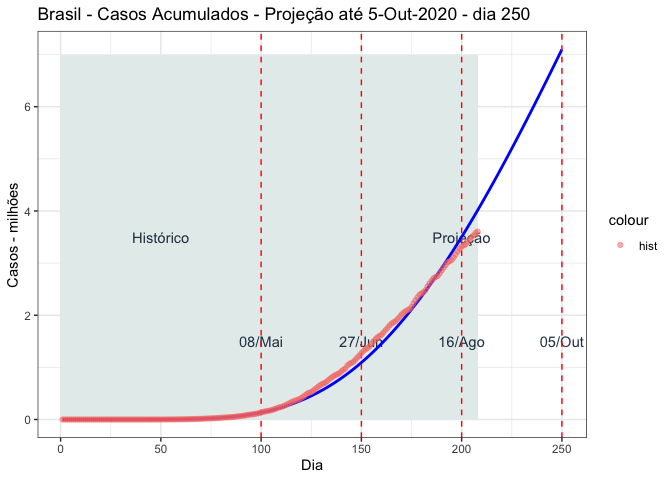<!-- -->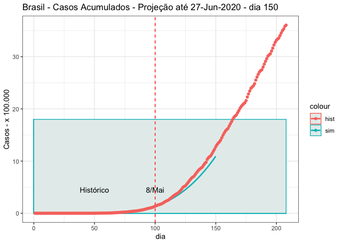<!-- -->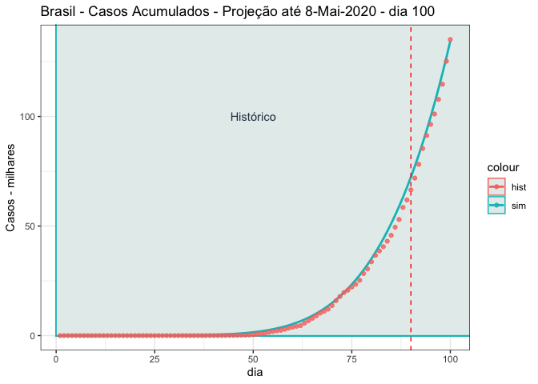<!-- -->


## Óbitos reais vs simulados


Table: Obitos novos reais e simulados

       dia  data          real   simulado
----  ----  -----------  -----  ---------
199    199  2020-08-14    1060       6284
200    200  2020-08-15     709       6343
201    201  2020-08-16     620       6402
202    202  2020-08-17     684       6460
203    203  2020-08-18    1352       6518
204    204  2020-08-19    1212       6575
205    205  2020-08-20    1204       6631
206    206  2020-08-21    1054       6687
207    207  2020-08-22     892       6742
208    208  2020-08-23     494       6797


Table: Obitos acumulados reais e simulados

       dia  data            real   simulado
----  ----  -----------  -------  ---------
199    199  2020-08-14    106523     322520
200    200  2020-08-15    107232     328827
201    201  2020-08-16    107852     335192
202    202  2020-08-17    108536     341615
203    203  2020-08-18    109888     348097
204    204  2020-08-19    111100     354636
205    205  2020-08-20    112304     361232
206    206  2020-08-21    113358     367884
207    207  2020-08-22    114250     374592
208    208  2020-08-23    114744     381355

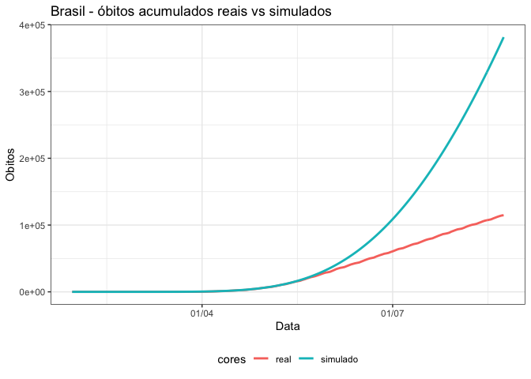<!-- -->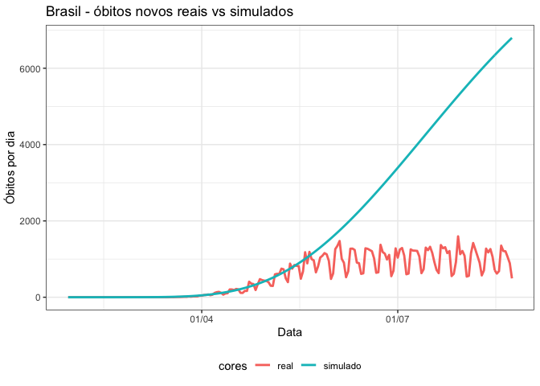<!-- -->

## Recuperados

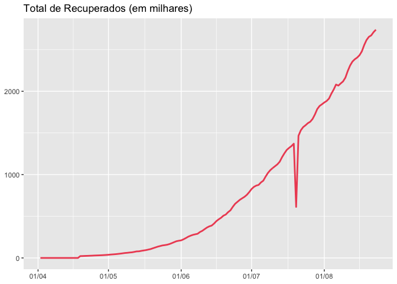<!-- -->


## Métricas de ajuste

### Ajuste dos casos acumulados, real vs simulado


Table: Ajuste dos casos acumulados, real vs simulado

Métrica      Índice
--------  ---------
rmse       102132.6
rsq             1.0
mae         60143.2


### Ajuste dos casos novos, real vs simulado

Table: Ajuste dos casos novos, real vs simulado

Métrica     Indice
--------  --------
rmse       10537.3
rsq            0.8
mae         5583.7


### Ajuste dos óbitos acumulados, real vs simulado


Table: Ajuste dos óbitos acumulados, real vs simulado

Métrica      Índice
--------  ---------
rmse       80015.62
rsq            0.93
mae        40095.53


### Ajuste dos óbitos novos, real vs. simulado


Table: Ajuste dos óbitos novos, real vs simulado

Métrica     Índice
--------  --------
rmse       2255.35
rsq           0.55
mae        1316.02


## 2. SC - Santa Catarina


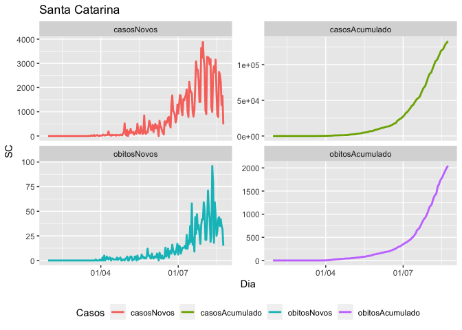<!-- -->

### Valores por separado

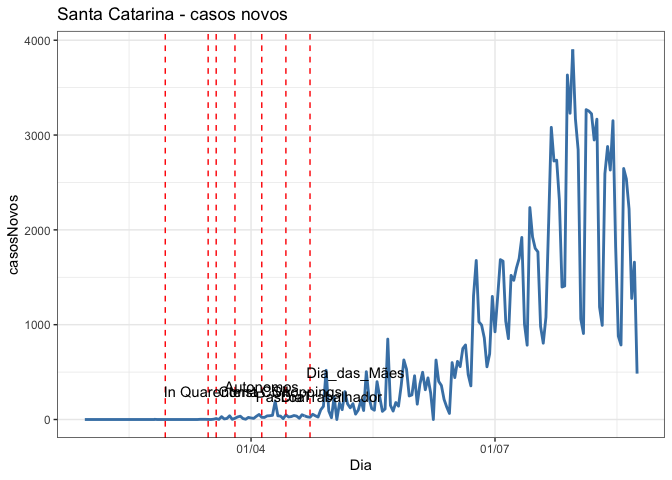<!-- -->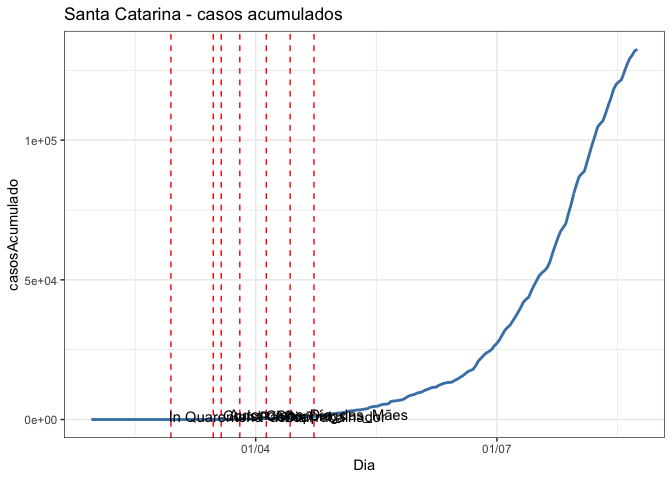<!-- -->


